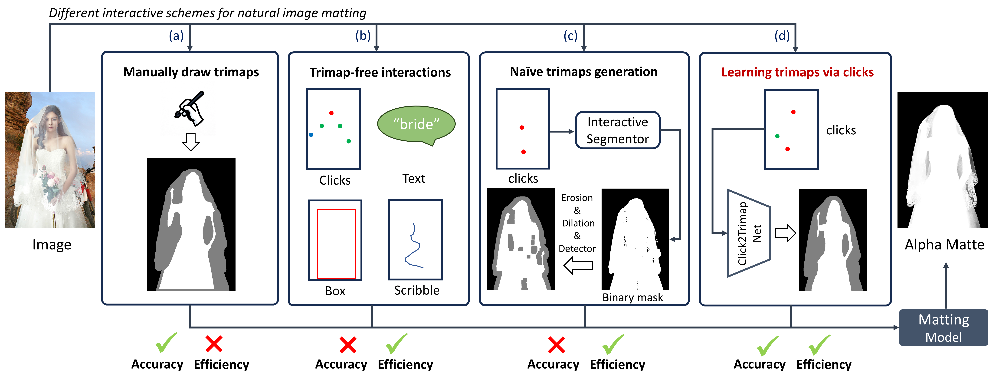
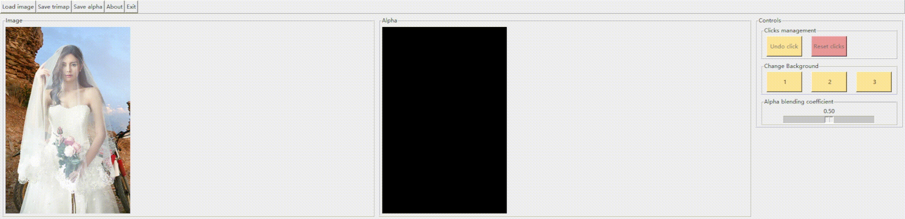
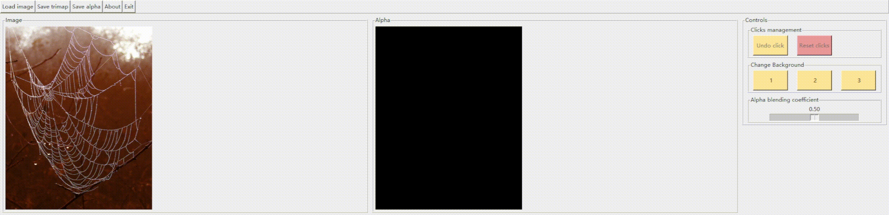
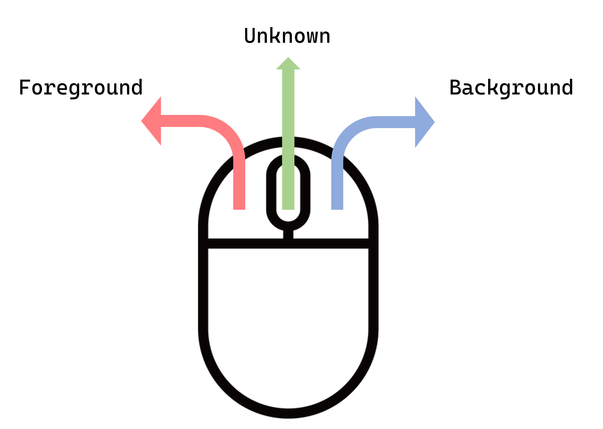

<div align="center">
<!-- <h2>Click2Trimap</h2> -->
<h3>Learning Trimaps via Clicks for Image Matting </h3>

Chenyi Zhang, Yihan Hu, Henghui Ding, Humphrey Shi, Yao Zhao, Yunchao Wei

<!-- Institute of Information Science, Beijing Jiaotong University
Nanyang Technological University
Georgia Tech & Picsart AI Research (PAIR) -->


<p align="center">
    <a href="https://opensource.org/licenses/MIT">
        
    </a>
    <a href="https://arxiv.org/pdf/2404.00335.pdf">
        
    </a>    
</p>


<p align="center">
  
</p>


</div>

## Quick Installation 
Our demo is developed in : Python3.8, PyTorch 1.10.1, CUDA 11.3.

Run the following command to install required packages. 
You can refer to the issues of [RITM](https://github.com/saic-vul/ritm_interactive_segmentation), [SimpleClick](https://github.com/uncbiag/SimpleClick) and [AEMatter](https://github.com/QLYoo/AEMatter) if you run into problems. 


```
pip3 install -r requirements.txt
```


## Demo
<p align="center">
  
<p align="center">
  
</p>
<p align="center">
  
</p>

**A command to run the demo.** 
```
python3 demo.py --checkpoint-c2t='path to click2trimap checkpoint' --checkpoint-matting='path to matting model checkpoint'
```

**Images can be found [here](https://github.com/ChenyiZhang007/Click2Trimap/tree/main/testimages).**

## Guidelines of Clicking

<p align="left">
  
</p>

**Tip 1:**<br>
Click the ***left*** mouse button on ***foreground*** region.<br>
Click the ***roll*** mouse button on ***unknown*** region.<br>
Click the ***right*** mouse button on ***background*** region.


**Tip 2:**<br>
Refer to the gif for how to provide appropriate clicks.

**Tip 3:**<br>
Using images with high resolutions leads to longer waiting time and might even run out of memory.


## Download 

### Checkpoints:

Click2Trimap: [Google Drive](https://drive.google.com/file/d/15vek5xyTrqCvsinZ7d6NXk_vNKNI3lHW/view?usp=sharing)

Matting Model: [AEMatter](https://mega.nz/file/7N4AEKrS#L4h3Cm2qLMMbwBGm1lyGOmVDTXJwDMAi4BlBauqNHrI)

<font color=LightSlateGray>We choose [AEMatter](https://github.com/QLYoo/AEMatter) as our trimap-based matting model in this demo because of its excellent performance and friendly memory usage. But it's also convenient to switch to any other trimap-based matting model if you want.</font>


## To do list
- [ ] Web UI
- [ ] HuggingFace Demo
- [ ] ...

## License
The code is released under the MIT License. It is a short, permissive software license. Basically, you can do whatever you want as long as you include the original copyright and license notice in any copy of the software/source. 

## Citation
```bibtex
@misc{zhang2024learing,
      title={Learing Trimaps via Clicks for Image Matting}, 
      author={Chenyi Zhang and Yihan Hu and Henghui Ding and Humphrey Shi and Yao Zhao and Yunchao Wei},
      year={2024},
      eprint={2404.00335},
      archivePrefix={arXiv},
      primaryClass={cs.CV}
}
```
## Acknowledgement
Our project is developed based on [RITM](https://github.com/saic-vul/ritm_interactive_segmentation), [SimpleClick](https://github.com/uncbiag/SimpleClick) and [AEMatter](https://github.com/QLYoo/AEMatter). Thanks for their nice demo GUI and wonderful work!
